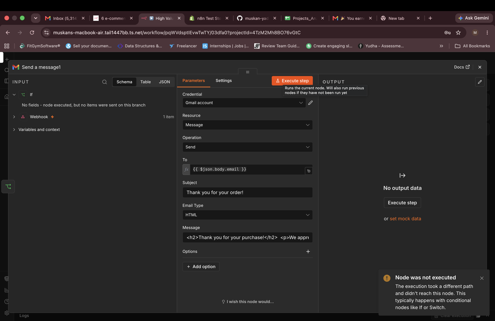
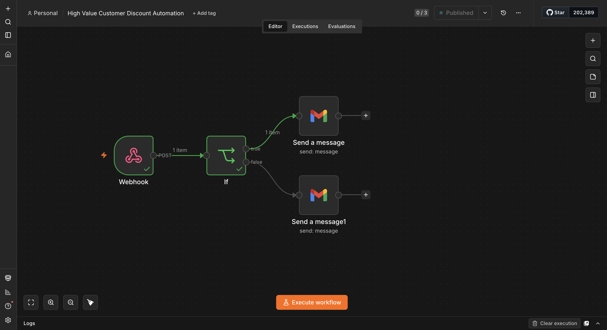

# High-Value Customer Discount Automation

An automated n8n workflow designed to reward high-value customers. When an order is placed, the workflow checks the total price. If the order total exceeds ₹100, the customer is automatically emailed a 10% discount code for their next purchase. Otherwise, they receive a standard thank-you email.

## Workflow Diagram

Here is the visual representation of the automation workflow built in n8n:

## Workflow Mechanics

1. **Webhook Trigger**: Listens for incoming HTTP POST requests containing order details (such as `email` and `total_price`).
2. **If Condition**: Evaluates if the order value is greater than 100 (`total_price > 100`).
3. **Send Discount Email (True)**: Sends a specialized email using Gmail with a discount code (`THANKYOU10`) to customers who spent over ₹100.
4. **Send Thank-You Email (False)**: Sends a standard purchase confirmation and thank-you email.

## Email Example

Below is an example of the email sent to a high-value customer:

## Getting Started

1. Import the `High-Value-Customer-Discount-Automation.json` file into your n8n instance.
2. Configure the **Webhook** node to listen to your e-commerce system's order events.
3. Authenticate the **Gmail** nodes with your Google workspace or personal account.
4. Activate the workflow!
